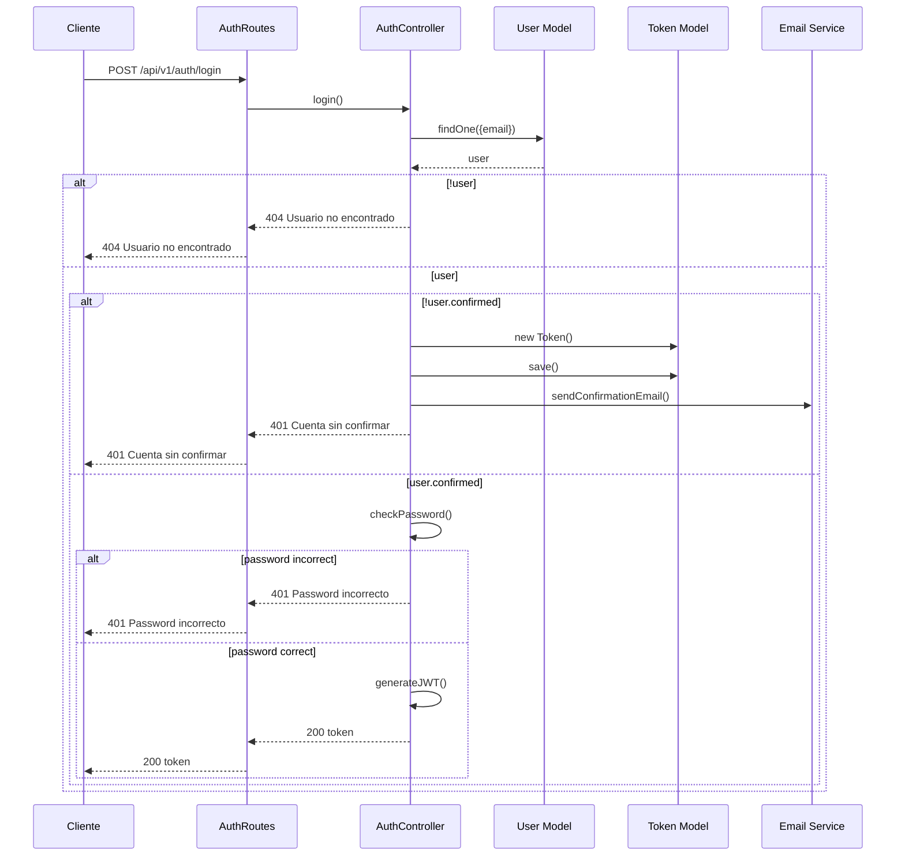
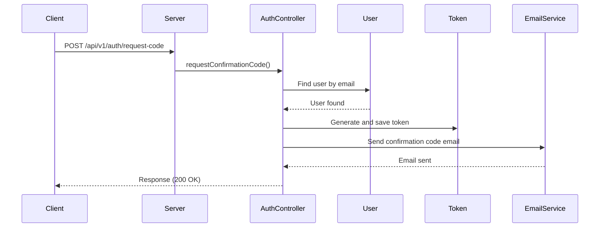
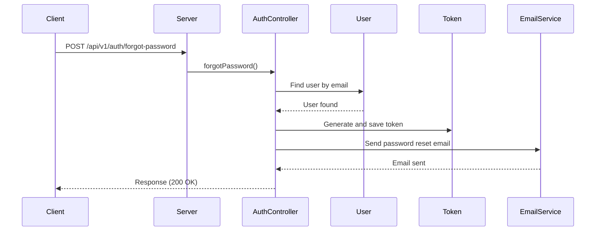
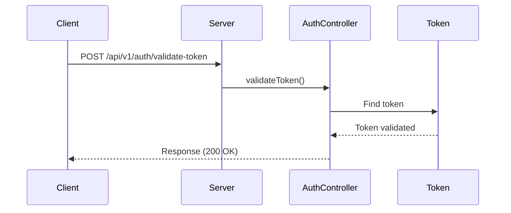
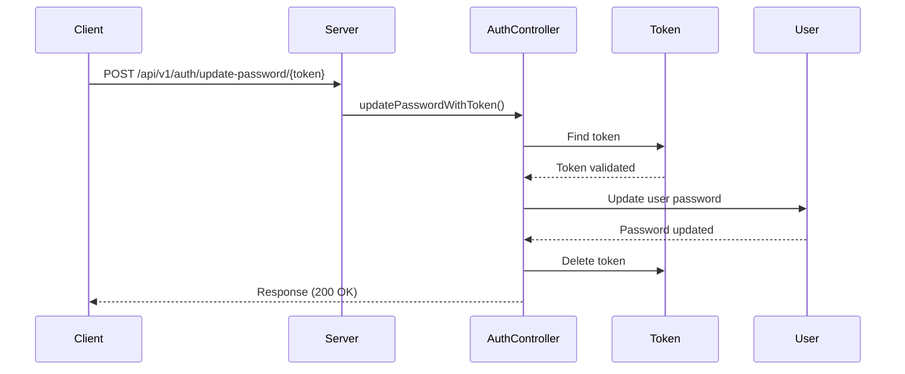
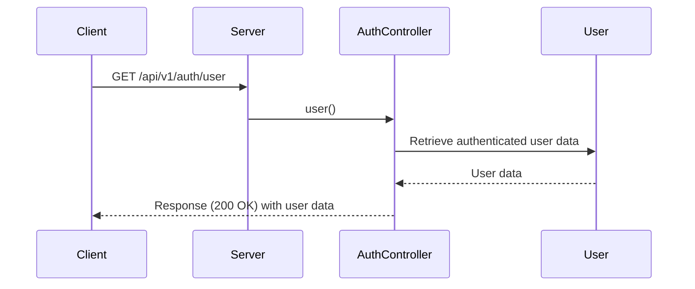
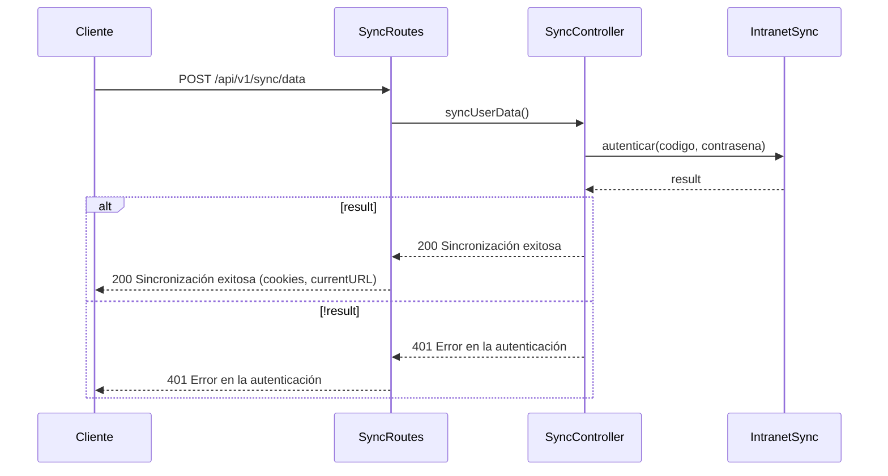
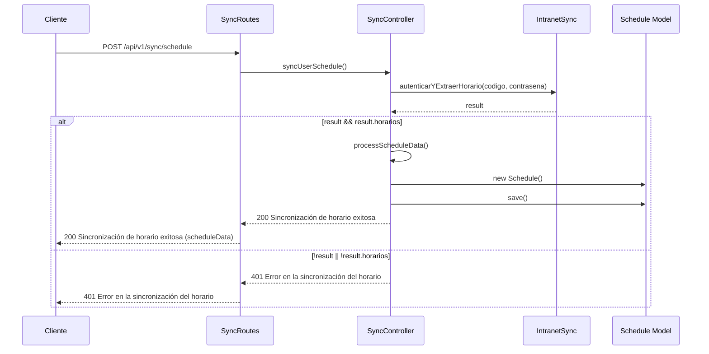
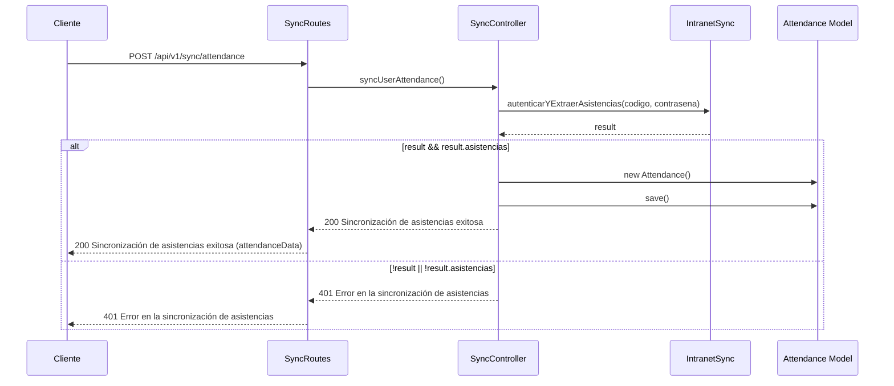

[](https://classroom.github.com/open-in-codespaces?assignment_repo_id=15707566)
# Proyecto de Sincronización de Intranet UPT

## Descripción
Este proyecto es una aplicación de Node.js que utiliza **Express** y **Puppeteer** para sincronizar datos desde la intranet de la Universidad Privada de Tacna (UPT). La aplicación permite a los usuarios obtener información importante, como las asistencias y los créditos acumulados, de manera automatizada y eficiente.

Además de la sincronización de datos, se ha implementado **Nodemailer**, una herramienta poderosa para el envío de correos electrónicos. Esta funcionalidad permite a los usuarios recibir correos electrónicos de confirmación de cuenta y restablecimiento de contraseña, lo que mejora la seguridad y la experiencia del usuario.

## Características Principales
- **Sincronización de Datos**: Acceso a la intranet de UPT para extraer datos relevantes de los usuarios y almacenarlos en MongoDB.
- **Gestión de Cuentas**: Creación de cuentas y envío de correos electrónicos de confirmación.
- **Restablecimiento de Contraseña**: Solicitud de restablecimiento de contraseña mediante un enlace y un token.
- **API REST**: Interfaz de API REST para facilitar la comunicación entre el cliente y el servidor.

## Desacripcion del proceso de sincronización
- Autenticación: Se realiza el inicio de sesión en el sistema externo utilizando las credenciales del usuario. Esto se gestiona mediante una simulación del ingreso a través de un navegador automatizado que maneja el captcha y otras validaciones de seguridad.
- Sincronización de Horario: Una vez autenticado, el sistema recupera el horario del usuario. Los datos extraídos se estructuran para garantizar que estén correctamente formateados y luego se almacenan en nuestra base de datos, lo que permite un acceso rápido y eficiente desde nuestra aplicación.
- Sincronización de Asistencias: Similar al horario, el sistema también obtiene la información de asistencias del usuario desde el sistema externo. Estos datos se procesan y guardan, proporcionando un historial completo de la asistencia del usuario a sus clases.
- Manejo de Errores: Durante todo el proceso, se implementan verificaciones y registros para identificar posibles errores, como problemas de autenticación, fallos en la extracción de datos, o dificultades en la conexión con el sistema universitario. En caso de fallas, se notifican adecuadamente al usuario para que pueda tomar acción.
- Seguridad y Sesiones: Para proteger la información del usuario, se maneja de forma segura el manejo de tokens y cookies durante el proceso de sincronización. Esto asegura que los datos sean transmitidos y almacenados de manera segura durante todo el flujo.


## Rutas API
### Autenticación
- **POST** `/api/v1/auth/create-account`: Crear una cuenta.
 ```mermaid
sequenceDiagram
    participant C as Cliente
    participant AR as AuthRoutes
    participant AC as AuthController
    participant U as User Model
    participant T as Token Model
    participant E as Email Service

    C->>AR: POST /api/v1/auth/create-account
    AR->>AC: createAccount()
    AC->>U: findOne({email})
    U-->>AC: userExists
    alt userExists
        AC-->>AR: 409 Usuario ya registrado
        AR-->>C: 409 Usuario ya registrado
    else !userExists
        AC->>AC: hashPassword()
        AC->>U: new User()
        AC->>T: new Token()
        AC->>E: sendConfirmationEmail()
        AC->>U: save()
        AC->>T: save()
        AC-->>AR: 200 Cuenta creada
        AR-->>C: 200 Cuenta creada
    end
```
- **POST** `/api/v1/auth/login`: Iniciar sesión.

- **POST** `/api/v1/auth/request-code`: Solicitar código de confirmación.

- **POST** `/api/v1/auth/forgot-password`: Solicitar restablecimiento de contraseña.

- **POST** `/api/v1/auth/validate-token`: Validar token de restablecimiento de contraseña.

- **POST** `/api/v1/auth/update-password/{token}`: Actualizar contraseña con token.

- **GET** `/api/v1/auth/user`: Obtener datos del usuario autenticado.


### Sincronización
- **POST** `/api/v1/sync/data`: Sincronizar datos del usuario.

- **POST** `/api/v1/sync/schedule`: Sincronizar el horario del usuario.

- **POST** `/api/v1/sync/attendance`: Sincronizar y obtener las asistencias del usuario.

- **POST** `/api/v1/sync/credits`: Sincronizar y obtener los créditos acumulados del usuario.
```mermaid

```

## Instalación

Para instalar y ejecutar el proyecto, sigue estos pasos:

1. **Clona el repositorio**:
   ```bash
   git clone https://github.com/UPT-FAING-EPIS/proyecto-si8811b-2024-ii-u1-backend-nodejs.git
   cd nombre-del-repositorio
2. **Ejecutar**:
   ```bash
    npm install
    npm run dev:api